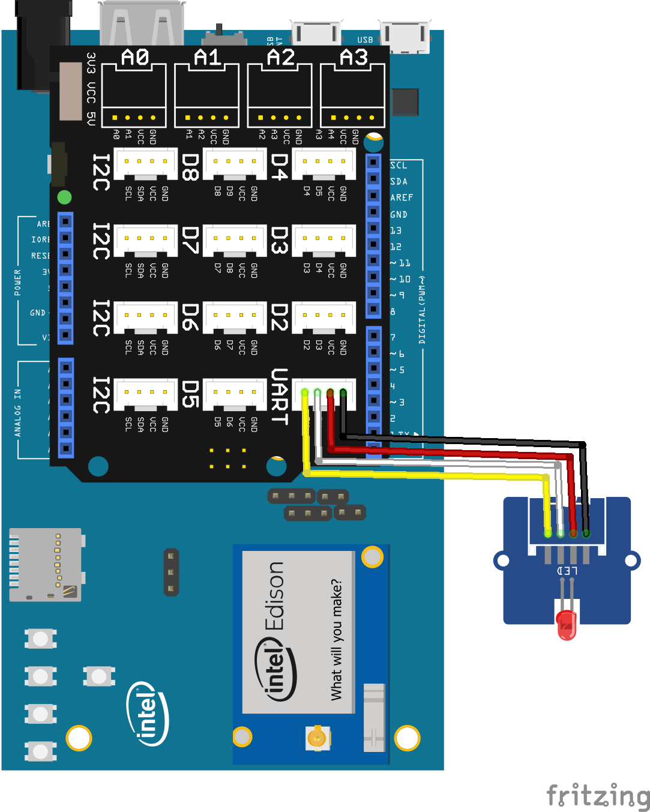

Grove led sample for Android Things using UPM
--------------------------------------------

This example demonstrates a LED connection using UPM.

build.gradle:

   ````
   dependencies {
       compile 'io.mraa.at.upm:upm_grove:1.+'
       compile 'io.mraa.at:mraa:1.+'
       provided 'com.google.android.things:androidthings:0.4-devpreview'
   }
   ````
Java:
````
led = new upm_grove.GroveLed(gpioIndex);
led.on();
led.delete();
````


Pre-Requisites:
---------------
Use of the Grove Kit (for Joule or Edison) makes this easy. See the following links for getting
a starter kit.

*  https://www.seeedstudio.com/Grove-Maker-Kit-for-Intel-Joule-p-2796.html
*  https://www.seeedstudio.com/Grove-Starter-Kit-V3-p-1855.html


You will need:

1. Android Things compatible board.
2. Grove header or Breakout board. [if using an external LED]
3. A LED (best if you use the Grove LED). [if using an external LED]


Build and install:
------------------

On Android Studio, select the "groveled" module in select box by the "Run" button
and then click on the "Run" button.



Changing the GPIO pin
---------------------
This example uses a GPIO (digital output) to light an LED. The GPIO could be connected
via the shield to a Grove LED... or it could be a LED on a brakeout board wired directly to
a GPIO line and ground (best to also have a resister inline).

The GPIO line to be used is specified in the strings.xml file (src/res/values directory).

````
<resources>
    <string name="app_name">GroveLed</string>
    <string name="Led_Edison_Arduino">IO13</string>
    <string name="Led_Edison_Sparkfun">GP12</string>
    <string name="Led_Joule_Tuchuck">LEDWIFI</string>
</resources>
````

The code will automatically determine the board type being run on (modify BoardDefaults.java
in the driver library to add another board) and select a string from this file for the GPIO line.
The above example uses IO13the Edison Arduino shield and LEDWIFI on the Joule Tuchuck
development board. These strings are programmed into the Peripheral Manager and read from their
into the UPM library to determine the GPIO pin to be used; they correspond to on-board LEDs for
those devices and you do not need to add an external LED to use this example.

See the top level README.md for a table describing the available GPIO pins and where to find them
on the board.
