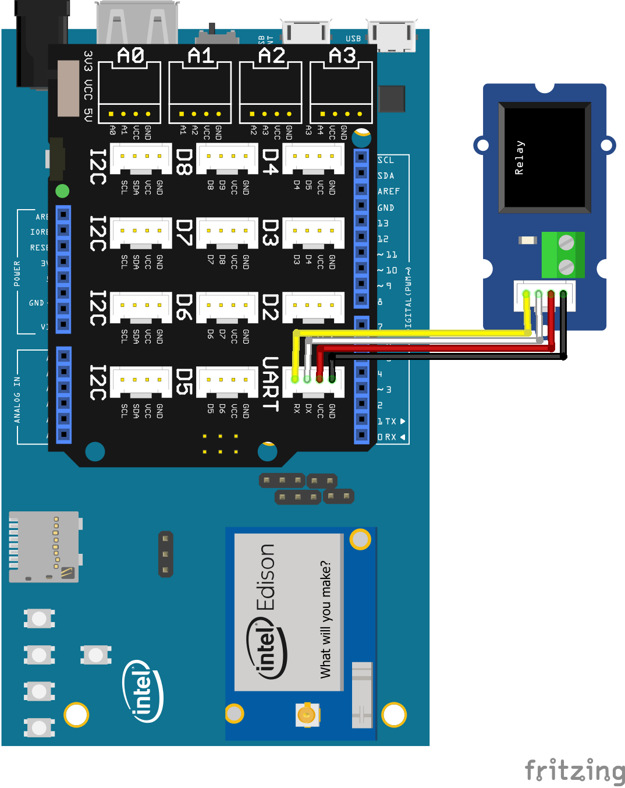

Grove relay sample for Android Things using UPM
----------------------------------------------

This example demonstrates controlling a relay using UPM.

build.gradle:

   ````
   dependencies {
       compile 'io.mraa.at.upm:upm_grove:1.+'
       compile 'io.mraa.at:mraa:1.+'
       provided 'com.google.android.things:androidthings:0.4-devpreview'
   }
   ````
Java:
````
relay = new upm_grove.GroveRelay(gpioIndex);
relay.on();
if (relay.isOn()){
    relay.off();
}
relay.delete();
````


Pre-Requisites:
---------------
Use of the Grove Kit (for Joule or Edison) makes this easy. See the following links for getting
a starter kit.

*  https://www.seeedstudio.com/Grove-Maker-Kit-for-Intel-Joule-p-2796.html
*  https://www.seeedstudio.com/Grove-Starter-Kit-V3-p-1855.html


You will need:

1. Android Things compatible board.
2. Grove header or Breakout board.
3. A Grove Relay.


Build and install:
------------------

On Android Studio, select the "groverelay" module in select box by the "Run" button
and then click on the "Run" button.




Changing the GPIO pin
---------------------
This example uses a GPIO (digital output) to set the state of a relay. The GPIO could be connected
via the shield to a Grove relay... or it could be a relay on a breakout board directly
connected between a GPIO line and ground.

The GPIO line to be used is specified in the strings.xml file (src/res/values directory).

````
<resources>
    <string name="app_name">GroveRelay</string>

    <string name="Relay_Edison_Arduino">IO0</string>
    <string name="Relay_Edison_Sparkfun">GP20</string>
    <string name="Relay_Joule_Tuchuck">J6_1</string>
</resources>
````

The code will automatically determine the board type being run on (modify BoardDefaults.java) and select a string from this file for the GPIO line.
The above example uses IO0 on the Edison Arduino shield and DISPLAY_0_RST_N on the Joule Tuchuck
development board. These strings are programmed into the Peripheral Manager and read from their
into the UPM library to determine the GPIO pin to be used.

See the top level README.md for a table describing the available GPIO pins and where to find them
on the board.
